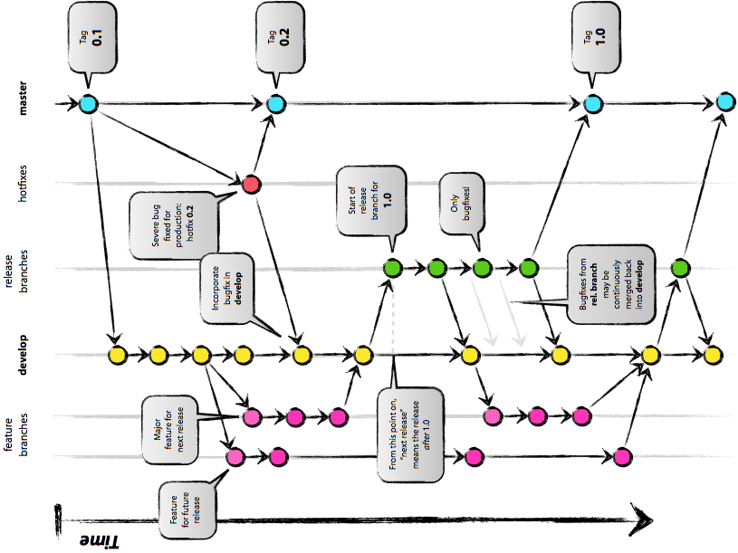

!SLIDE transition=cover

Branching Workflow
==================

!SLIDE center

The General Idea
================

!SLIDE center

The Overly-Complicated Version
------------------------------

!SLIDE

So what are we using?
=====================

Somewhere in between...

!SLIDE subsection transition=cover

Main Branches
=============

Always there to comfort you...

!SLIDE bullets incremental

Master
======

* holds stable code
* should be really stable
* is pointed to by version tags
* consists primarily of merges from develop and bugfix

!SLIDE bullets incremental

Develop
=======

* holds latest working code
* most commits should be merges from minor branches
* may have single commits which fix unforseen issues from minor branches

!SLIDE bullets incremental

Bugfix
======

* is based on the master branch
* holds bugfixes to the stable code
* should be merged into both develop and master
* contains both single commits for small bugfixes
  and merges of *bug/* branches for large ones

!SLIDE subsection transition=cover

Minor Branches
==============

To make your life more organized...

!SLIDE bullets incremental

Feature Branches
================

* take the form 'feature/*some-feature-name*'
* hold commits for feature development
* should only be merged into develop

!SLIDE bullets incremental

Bug Branches
============

* take the form 'bug/*bug-number*-*bug-description*'
* hold commits for bug fixes
* should be merged into bugfix

!SLIDE bullets incremental

Refactor Branches
=================

* take the form 'refactor/*description-of-refactor*'
* hold commits for major or minor code refactorings
* should be merged into develop

!SLIDE bullets incremental

Minor Branches...
=================

* may contain which is incomplete and/or non-functional
* should not have public-facing code which breaks 
  the build or tests

!SLIDE small

Public vs Private Commit Series
===============================

When you are working on a **local machine** or
**personal GH fork**, you may have a series of commits
which looks like this:

* implemented feature part 1
* fixed issue in feature part 1 implementation
* implemented feature part 2 and fixed issue in feature part 1
* implemented feature part 3
* implemented feature part 4 and added to feature part 2
* fixed feature part 3 and added to feature part 1

This is ok for while you are developing...

!SLIDE small

However...
==========

This kind of commit series *should not* be pushed to the
central (upstream) GH repository.  Before you push or submit
a pull request, you should rebase the changes to look like this:

* implemented part 1
* implemented part 2
* implemented part 3
* implemented part 4

If part 2 breaks existing functionality without part three, then
there should really *only be three parts*:

* implemented part 1
* implemented part 2 (parts 2 and 3)
* implemented part 3 (part 4)
